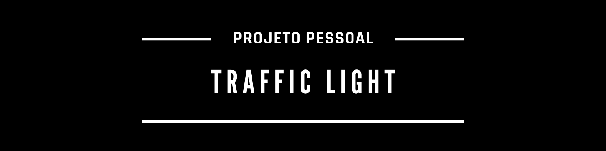

## **Sobre**
A ideia desse projeto surgiu a partir de um exercício de JavaScript do site [Codewars](https://www.codewars.com/kata/58649884a1659ed6cb000072/train/javascript).
Que propunha a escrita de um código para controlar os semáforos da cidade. Para isso deveria-se usar uma função para lidar com cada mudança de verde para amarelo, para vermelho e depois verde novamente.
A função receberia uma string como argumento que representa o estado atual da luz e retorna uma string que representa o estado para qual a luz deve mudar.
Por exemplo, update_light('green') deve retornar 'yellow'.  

## **Status do projeto**
:heavy_check_mark: Concluído :heavy_check_mark:

## **Demonstração**
Você pode acessar uma versão dinâmica desse projeto no CodePen - [Clique aqui para ser redirecionado ao site](https://codepen.io/suhlimakz/project/editor/ZBmLvz  )

## **Tecnologias**
As seguintes tecnologias foram usadas na construção desse projeto:

## **Créditos**
Os seguintes sites foram usados, como fonte de informação para as mensagens exibidas em tela:
- [Jusbrasil | Regulamento do Código Nacional de Trânsito ](https://www.jusbrasil.com.br/topicos/12005222/artigo-71-do-decreto-n-62127-de-16-de-janeiro-de-1968) - Significado das cores
- [Minutos Seguros | Entenda as cores do semáforo ](https://www.minutoseguros.com.br/blog/entenda-as-cores-do-semaforo/) - Curiosidades

## **Autor**

<a href="https://www.codewars.com/users/suhlimakz" target="_blank">

<a href="https://codepen.io/suhlimakz" target="_blank">

